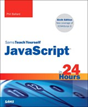

```
Roberto Nogueira  BSd EE, MSd CE
Solution Integrator Experienced - Certified by Ericsson
```

# Javascript in 24 hours



## Table of Contents

```
[x] Introduction
Part I: First Steps with JavaScript
[x] HOUR 1: Introducing JavaScript
[x] HOUR 2: Writing Simple Scripts
[x] HOUR 3: Using Functions
[x] HOUR 4: DOM Objects and Built-in Objects

Part II: Cooking with Code
[x] HOUR 5: Numbers and Strings
[ ] HOUR 6: Arrays
[ ] HOUR 7: Program Control

Part III: Objects
[ ] HOUR 9: Scripting with the DOM
[ ] HOUR 10: Meet JSON

Part IV: HTML and CSS
[ ] HOUR 11: JavaScript and HTML5
[ ] HOUR 12: JavaScript and CSS
[ ] HOUR 13: Introducing CSS3

Part V: Using JavaScript Libraries
[ ] HOUR 14: Using Libraries
[ ] HOUR 15: A Closer Look at jQuery
[ ] HOUR 16: The jQuery UI User Interface Library
[ ] HOUR 17: Ajax with jQuery

Part VI: Advanced Topics
[ ] HOUR 18: Reading and Writing Cookies
[ ] HOUR 19: Coming Soon to JavaScript
[ ] HOUR 20: Using Frameworks
[ ] HOUR 21: JavaScript Beyond the Web Page

Part VII: Learning the Trade
[ ] HOUR 22: Good Coding Practice
[ ] HOUR 23: Debugging Your Code
[ ] HOUR 24: JavaScript Unit Testing

Part VIII: Appendices
[ ] APPENDIX A: Tools for JavaScript Development
[ ] APPENDIX B: JavaScript Quick Reference
```
